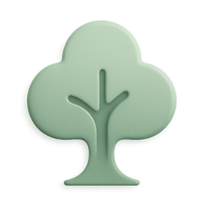

# 小树壁纸 Next

<p align="center">
  <a href="./README.md">English</a> | 简体中文
</p>

<p align="center">
  
</p>

<p align="center">
  一个集壁纸浏览、搜索、收藏、制作、动态桌面与自动化于一体的桌面壁纸管理器。
</p>

<p align="center">
  <a href="https://github.com/Little-Tree-Studio/Little-Tree-Wallpaper-Next/releases"></a>
  
  <a href="LICENSES"></a>
  
  
  
  <a href="https://github.com/Little-Tree-Studio/Little-Tree-Wallpaper-Next/stargazers"></a>
</p>

<p align="center">
  <a href="https://github.com/Little-Tree-Studio/Little-Tree-Wallpaper-Next/releases">下载发行版</a>
  ·
  <a href="https://docs.zsxiaoshu.cn/docs/wallpaper/">使用文档</a>
  ·
  <a href="https://github.com/Little-Tree-Studio/Little-Tree-Wallpaper-Next/issues">问题反馈</a>
</p>

> [!WARNING]
> 小树壁纸 Next 2.0 目前处于 Beta 测试阶段，功能、配置与扩展文件格式以及 API 均可能随时调整，并可能产生不兼容变更，不建议用于关键生产环境。动态壁纸、插件和高级自动化仍属于高级功能，使用前请阅读下方的[注意事项](#注意事项)。

## 功能特性

- **多来源壁纸**：浏览 Bing、Windows 聚焦、拾光壁纸、CNU、Pixiv、IntelliMarkets 与自定义壁纸源。
- **图片搜索与嗅探**：通过百度图片、Pexels、Pixiv 等来源搜索图片，也可以从网页中提取可用图片。
- **收藏与整理**：使用收藏夹、标签和历史记录管理壁纸，支持收藏包导入、导出和远程资源本地化。
- **壁纸制作**：通过多图层画布组合文字、图片、形状、渐变和滤镜，保存 `.ltwp` 工程或导出 PNG/JPEG。
- **AI 图片生成**：支持 Pollinations AI、`models.dev` 提供商和 OpenAI-compatible 图片生成接口。
- **动态桌面**：在 Windows 上使用本地视频、图片、文件夹或收藏夹创建动态场景，并添加时钟、日期、便笺等桌面小组件。
- **可视化自动化**：使用简单、积木或节点图模式，按应用启动、间隔和每日时间切换壁纸或执行组合操作。
- **主题系统**：自定义浅色/深色语义颜色、应用背景、字体和 CSS，支持 `.lttheme` 导入导出。
- **资源商店**：内置商店直接浏览和安装主题、壁纸源与插件，支持官方源和自定义商店源，下载时校验大小与 SHA-256。
- **插件系统**：通过 `.ltp` Python 插件扩展页面、导航、资源页、主题变量和动态壁纸小组件。
- **本地桌面应用**：React 界面由 LumiView 承载，FastAPI 后端仅监听随机回环端口，并使用每次启动生成的令牌保护本地 API。

## 平台支持

| 平台 | 静态壁纸 | 核心管理功能 | 动态壁纸 | 说明 |
| --- | --- | --- | --- | --- |
| Windows 10/11 | 支持 | 支持 | 实验性支持 | 功能最完整；动态壁纸依赖 Explorer WorkerW |
| macOS | 代码支持 | 原则上支持 | 不支持 | 源码运行和打包需自行验证 AppKit 与系统权限 |
| Linux | 部分支持 | 原则上支持 | 不支持 | 静态壁纸依赖桌面环境及 `gsettings`、`feh` 等可用工具 |

当前发布和测试以 Windows 为主。Linux 对 GNOME、KDE Plasma、XFCE、Cinnamon、MATE、Deepin、LXQt/LXDE、Hyprland 和 Sway 等环境提供适配，但实际效果取决于桌面环境、显示服务器和已安装工具。

## 快速开始

### 使用发行版

普通用户可从 [Releases](https://github.com/Little-Tree-Studio/Little-Tree-Wallpaper-Next/releases) 下载对应平台的构建产物。Windows 版本直接运行 `LittleTreeWallpaper.exe`。

在线壁纸、搜索、网页嗅探和 AI 图片生成需要网络连接，服务可用性取决于对应的第三方接口。项目本身不要求注册账号；部分自定义图片生成服务或壁纸源可能需要单独配置 API Key。

### 从源码运行

环境要求：

- Python 3.12 或更高版本
- Node.js 20 或更高版本，以及 npm
- 推荐安装 [uv](https://docs.astral.sh/uv/)
- Windows 动态壁纸需要 Windows 10/11 与正常运行的 Explorer 桌面

以下命令均从仓库根目录执行。

1. 克隆仓库：

```powershell
git clone https://github.com/Little-Tree-Studio/Little-Tree-Wallpaper-Next.git
cd Little-Tree-Wallpaper-Next
```

2. 安装并构建前端：

```powershell
npm install --prefix frontend
npm run build --prefix frontend
```

3. 安装后端依赖：

```powershell
uv sync --project backend --group dev --no-install-project
```

`--no-install-project` 只同步应用依赖，源码会直接从仓库根目录导入。

不使用 uv 时，可以创建虚拟环境并按依赖文件安装：

```powershell
python -m venv .venv
.\.venv\Scripts\python -m pip install -r backend\requirements.txt
```

4. 启动应用：

使用 uv：

```powershell
uv run --project backend --no-sync python -m backend.main
```

使用本地虚拟环境：

```powershell
.\.venv\Scripts\python -m backend.main
```

后端会在 `127.0.0.1` 上选择随机空闲端口，随后打开 LumiView 应用窗口。前端开发服务器不能独立替代桌面入口，因为大部分功能依赖本地后端 API。

如需在当前进程中隐藏右下角测试版本水印，可在启动命令或发行版可执行文件后添加 `--no-watermark`。该参数不会修改持久设置，也不会关闭测试版本提示弹窗。

## 开发与测试

### 前端

```powershell
npm run dev --prefix frontend
npm run test:ci --prefix frontend
npm run build --prefix frontend
npm run preview --prefix frontend
```

前端使用 React 19、TypeScript、Vite、HeroUI 3、Tailwind CSS 4 和 React Router。

### 后端测试

```powershell
uv run --project backend --no-sync python -m unittest discover -s backend/tests -p "test_*.py"
```

测试覆盖本地 FastAPI 服务、设置管理、插件、主题、网页嗅探、动态壁纸、自动化、托盘和部分在线来源。涉及第三方网络接口或 Windows 桌面的能力仍可能受运行环境影响。

### 构建应用

完整构建会同步构建元数据、编译前端并调用 PyInstaller：

```powershell
uv run --project backend --no-sync python tools/build.py
```

常用构建选项：

```powershell
# 构建稳定渠道版本
uv run --project backend --no-sync python tools/build.py --build-type stable --built-by pyinstaller

# 复用已有 frontend/dist，仅重新打包
uv run --project backend --no-sync python tools/build.py --no-frontend

# 生成目录形式产物（dist/LittleTreeWallpaper/）
uv run --project backend --no-sync python tools/build.py --mode folder

# 生成目录产物并编译多语言 NSIS 安装程序（需要 NSIS 3）
uv run --project backend --no-sync python tools/build.py --mode installer

# 只预览元数据变化
uv run --project backend --no-sync python tools/build.py --dry-run
```

PyInstaller 产物默认位于根目录 `dist/`。构建只针对当前宿主平台，不会一次生成所有平台的可执行文件。更多元数据同步、打包选项和插件打包说明见 [`docs/TOOLING.md`](docs/TOOLING.md)。

## 项目结构

```text
Little-Tree-Wallpaper-Next/
├── backend/             Python 后端、桌面入口、服务与测试
│   ├── plugins/         插件校验、上下文与生命周期管理
│   ├── services/        壁纸源、存储、主题、动态壁纸和自动化
│   └── tests/           unittest 测试
├── frontend/            React + HeroUI 前端
│   ├── public/          应用图标等静态资源
│   └── src/             页面、组件、主题、插件渲染与 API 客户端
├── docs/                插件、主题、构建工具与版本规范文档
├── tools/               元数据同步、应用构建与插件打包工具
├── build/               应用静态元数据
├── build.json           版本与构建来源信息
└── build.spec           PyInstaller 构建配置
```

## 扩展开发

- [插件开发文档](docs/PLUGINS.md)：`.ltp` 格式、清单、权限、声明式 UI、Python 生命周期和打包限制。
- [主题系统文档](docs/THEMES.md)：`.lttheme` 格式、语义颜色、背景媒体、字体资源和自定义 CSS。
- [版本规范](docs/VERSIONING.md)：应用、插件、主题、壁纸源与商店资源的版本号格式、比较规则和发布约定。
- [工具说明](docs/TOOLING.md)：构建元数据、PyInstaller 流程和可复现插件打包。

### 商店资源发布

扩展作者通过官方资源仓库发布主题、壁纸源和插件：[Little-Tree-Wallpaper-Resources](https://github.com/shu-shu-1/Little-Tree-Wallpaper-Resources)。按照仓库内的模板编写条目 TOML 并通过 Pull Request 提交资源文件；合并后即可在内置商店中浏览和安装。

商店从商店源读取 `index.json` 与 TOML 元数据（官方源：`https://wallpaper.api.zsxiaoshu.cn`，可在设置中切换自定义源）。每个条目需通过 `download_path`/`download_url` 或 `assets` 提供下载地址，可选附带 `sha256` 供安装校验。壁纸源条目要求 `protocol_version >= 4`，详见[版本规范](docs/VERSIONING.md)。

## 数据目录

应用通过 `platformdirs` 选择当前系统的标准用户目录，并分别保存：

- 配置：应用设置、主题和插件配置
- 数据：下载内容、壁纸源、插件及插件数据
- 缓存：图片缓存、日志、网页嗅探结果和异常退出报告

具体路径可在应用的“设置”和“帮助与反馈”页面中查看或打开。API Key 等提供商配置保存在本地配置文件中，请勿将个人配置目录提交到仓库或直接分享给他人。

## 注意事项

- **动态壁纸仅支持 Windows**：当前实现依赖未公开的 Explorer WorkerW 桌面窗口行为，Windows 更新或 Explorer 状态变化可能影响兼容性。
- **自动化依赖应用进程**：定时任务只在小树壁纸仍在运行时执行；“应用启动”触发不等同于操作系统开机启动。
- **谨慎导入高级自动化**：高级节点可以执行程序、读写文件、打开 URL 或触发系统电源操作，只应导入可信来源的 `.ltauto` 文件。
- **插件不是沙箱**：插件 Python 代码与应用拥有相同的当前用户权限，可以访问文件、网络、进程和环境变量。当前没有数字签名或发布者认证，只安装可信、可审计的插件。
- **主题也需要信任**：主题的自定义 CSS 会作用于整个应用界面，远程媒体和字体也可能发起网络请求，只导入可信主题。
- **在线来源由第三方提供**：内容、接口、限流策略和区域可用性可能随时变化。使用和传播图片时，请遵守来源站点条款并确认相应版权授权。
- **资源商店内容由第三方提供**：商店中的主题、壁纸源和插件来自对应作者，安装前请确认来源可信。壁纸源条目仅支持 `protocol_version >= 4` 的协议版本；插件安装遵循与本地导入相同的信任确认流程。

## 反馈与贡献

- 使用问题与常见说明：[项目文档](https://docs.zsxiaoshu.cn/docs/wallpaper/)
- Bug 与功能建议：[GitHub Issues](https://github.com/Little-Tree-Studio/Little-Tree-Wallpaper-Next/issues)
- 贡献指南：[`CONTRIBUTING.zh-CN.md`](./CONTRIBUTING.zh-CN.md)
- 安全政策与漏洞报告：[`SECURITY.zh-CN.md`](./SECURITY.zh-CN.md)
- 免责声明：[`DISCLAIMER.zh-CN.md`](./DISCLAIMER.zh-CN.md)

提交问题时建议附上应用版本、操作系统、复现步骤和日志。日志与异常退出报告可在“帮助与反馈”页面中查看和导出。

<!-- ## Star 历史

<picture>
  <source media="(prefers-color-scheme: dark)" srcset="https://api.star-history.com/svg?repos=Little-Tree-Studio/Little-Tree-Wallpaper-Next&type=Date&theme=dark" />
  <source media="(prefers-color-scheme: light)" srcset="https://api.star-history.com/svg?repos=Little-Tree-Studio/Little-Tree-Wallpaper-Next&type=Date" />
  
</picture> -->

## 许可证

本仓库根目录的 [`LICENSES`](LICENSES) 为 [GNU Affero General Public License v3.0](https://www.gnu.org/licenses/agpl-3.0.html) 全文。复制、修改或分发本项目时，请遵守该许可证的条款。
